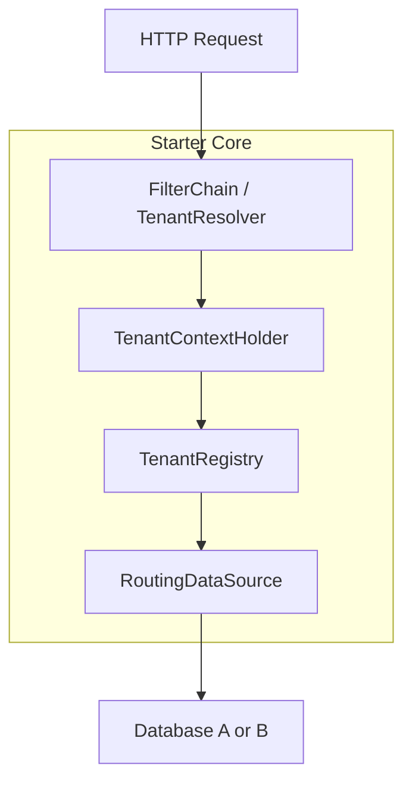

# 🧱 Architecture Diagram

This project follows a clean modular structure to enable flexible and pluggable multi-tenancy in Spring Boot applications.

---

## 🧠 Core Modules Overview

### 1. `starter/`

Contains all auto-configurations, filters, resolvers, and service logic that get triggered via Spring Boot auto-loading. This is what end-users consume.

**Packages inside:**

* `config/`: Auto-configuration + annotations like `@EnableTenantIsolation`
* `context/`: Thread-local `TenantContextHolder`
* `filter/`: Web filters to trigger resolution
* `registry/`: Pluggable tenant registry (in-memory, dynamic, DB-backed)
* `datasource/`: Routing and `DataSourceFactory`
* `resolution/`: Strategy interfaces + subdomain/header/JWT resolvers
* `actuator/`: Optional endpoint to view multitenancy health and context

### 2. `demo/`

A runnable Spring Boot application that consumes the starter to show:

* Per-DB strategy
* Subdomain/header-based routing
* In-memory tenant registry

### 3. `ego-logs/`

Logs of my’s engineering journey while building this. Inspired by *Blue Lock*.

### 4. `scripts/`

Placeholder for future utilities (database migration tools, shell scripts, etc.)

### 5. `daily/`

Staging or local debug artifacts (excluded from production)

---

## 🗺️ High-Level Architecture

---

## 🔍 Component Descriptions

### 🔹 `TenantResolver`

Resolves tenant ID from request (subdomain, headers, or JWT).

### 🔹 `TenantContextHolder`

Thread-local context that stores the current request's tenant ID.

### 🔹 `TenantRegistry`

Registry that holds configuration for all known tenants (in-memory or DB).

### 🔹 `RoutingDataSource`

A custom Spring `AbstractRoutingDataSource` implementation that switches DB connections based on tenant.

### 🔹 `EnableTenantIsolation`

Annotation to activate the multitenancy mechanism with chosen strategy.

### 🔹 `MultiTenancyAutoConfiguration`

Spring Boot config that registers all the above beans conditionally.

---

## 📌 Rendering the Diagram

Use [Mermaid Live Editor](https://mermaid.live) or tools like Obsidian/VSCode extensions to render the Mermaid chart.

---

This architecture is modular and extensible — future strategies like schema-based isolation, JWT claims, and runtime onboarding will plug cleanly into this skeleton.
